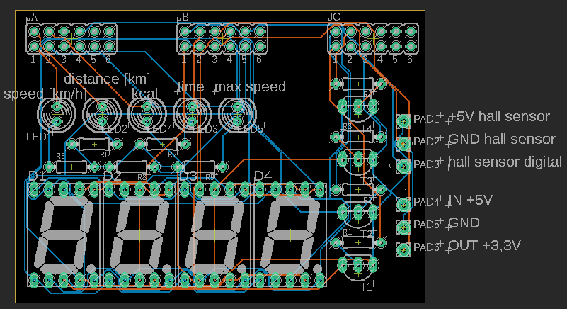
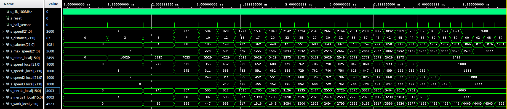
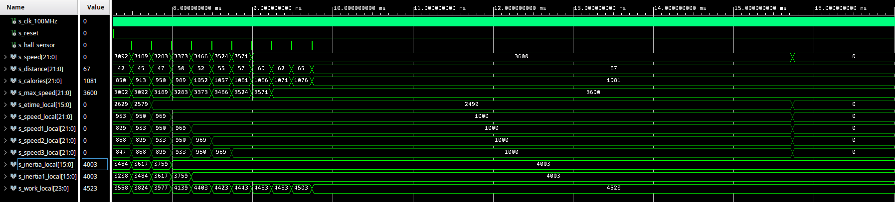

# Týmový projekt do předmětu BPC-DE1 
# Název projektu: Konzole pro rotoped 

### Členové týmu

1. [Smejkal Marek](https://github.com/xsmejk30/Digital-electronics-1)
2. [Socha Jakub](https://github.com/xsocha00/Digital-electronics-1)
3. [Soukeník Ondřej](https://github.com/ondrasouk/Digital-electronics-1)
4. [Stupka Tomáš](https://github.com/ondrasouk/Digital-electronics-1)
5. [Šomšák Martin ](https://github.com/MartinSomsak00/DE1)

[Link to GitHub project folder](https://github.com/ondrasouk/Digital-Electronics-1-project)

## Úvod

Úkolem tohoto projektu bylo vytvořit konzoli pro měření otáček rotopedu. Toto měření následně vede na rozšíření jako napříkad měření rychlosti, ujeté vzdálenosti, průměrné rychlosti atd. 

V našem případě jsme se rozhodli pro snímání otáček použít čidlo [44E](https://dratek.cz/arduino/7735-halluv-senzor-44e.html?gclid=CjwKCAjwj6SEBhAOEiwAvFRuKIS_8uQ_ZEzr9x-yYRR3fPEQ0RS04KZdMaqaGm8xElUVrgnHnGZ3SxoCdZ4QAvD_BwE), který obsahuje halovu sondu. Napájecí napětí čidla je 4,5-24V Výstupem čidla je buď logická 0 nebo 1. Pokud tento sensor umístíme na pevný bod v blízkoti otáčenícího kola, je nutné přidat na otáčejí se kole magnetický puk. Následně při otáčení kola snímač vygeneruje signál pomocí kterého můžeme určit požadované veličiny.

Pro následní zobrazení měřené veličiny byl využit 4x7 segmentový displej a tři ledky pro indikaci zobrazovaného výstupu (zapnuto/vypnuto, přepínání zobrazení, reset systému).


## Popis zapojení 
Zapojení a PCB jsou navrženy v programu Eagle. 
V zapojení jsou použity 7 segmentové displeje se společnou anodou. Stejné segmenty jednotlivých digitů jsou pospojovány. Pmod JC slouží k přepínání napájení mezi jednotlivými digity. K Pmod JB jsou připojeny jednotlivé skupiny segmentů a k Pmod JA jsou připojeny LED a hallův senzor. Výhodnější by bylo pouřít jednou součástku obsahující 4 digity (stejně jako na desce Nexys A7), ale Eagle takovou součástku neobsahuje.
PADy 1, 2 a 3 slouží k připojení hallova senzoru. PAD1 je určen k připojení +5V protože použitý hallův senzor pracuje od 4,5V, ale na Pmod porty mají 3,3V. 




| **PCB** | **Pmod JA** | **Port** |
| :-: | :-: | :-: |
| AN0 | 4 | D12 |
| AN1 | 3 | A11 | 
| AN2 | 2 | B11 | 
| AN3 | 1 | G13 | 

| **PCB** | **Pmod JB** | **Port** |
| :-: | :-: | :-: |
| a | 1 | E15 |
| b | 2 | E16 | 
| c | 3 | D15 | 
| d | 4 | C15 | 
| e | 7 | J17 | 
| f | 8 | J18 | 
| g | 9 | K15 | 
| P | 10 | J15 |
| GND | 5 |  |
| 3,3V | 6 |  |

| **PCB** | **Pmod JC** | **Port** |
| :-: | :-: | :-: |
| LED1 | 1 | U12 |
| LED2 | 2 | V12 | 
| LED3 | 3 | V10 | 
| LED4 | 4 | V11 | 
| LED5 | 7 | T13 | 
| hall sensor | 8 | U13 | 

## Programová část
### Popis řešení měření času
Čidlo vždy vygeneruje klesající hranu, když kolem něj projede magnet umístěný na kole setrvačníku. V top modulu vstup invertujeme, pro snažší pochopení. Tento signál značí jednu otáčku setrvačníku, který simuluje setrvačnost jízdního kola a člověka na něm. Interval mezi klesajícími hranami je tedy doba za kterou virtuální kolo urazí jednu otočku kola. Podle vzorečku v=s/t můžeme vypočítat rychlost, kde s je virtuální vzdálenost jedné otočky setrvačníku (je tedy konstantní) a t je čas mezi signálem ze senzoru.

K měření času se dá použít hodinový zdroj z FPGA který má 100&nbsp;MHz. Rozlišovací schopnost 10&nbsp;ns je pro toto použití moc přesná a plítvali bychom zbytečně prostředky na např. 32 bitovém čitači, když můžeme použít 16 bitový. Tedy aby pro čas kolem 250&nbsp;us se musí prodloužit interval mezi náběžnými hranami. Pro tento účel byla použita dělička časových hodin v podobě modulu clock_enable, který byl využit z cvičení v předmětu DE1. Poté něčím musíme počítat jednotlivé pulzy. Zde byl využit naprogramovaný obousměrný čítač  ze cvičení, který pro tento účel zjednodušíme a uděláme z něj jen jednoduchý čítač nahoru. Nasčítaný počet pulzů tedy odpovídá času, který trvala jedna otočka setrvačníku. Pro vyšší přesnost se při každé otočce vyresetuje i modul clock_enable.
#### Náhled do bloku s instancemi `clock_enable` a `cnt_up` a procesu `p_etime` (elapsed time)
```vhdl
    --------------------------------------------------------------------
    -- Instance (copy) of clock_enable entity
    clk_en1 : entity work.clock_enable
        generic map(
            g_MAX => g_TIME_UNIT_LENGHT
        )
        port map(
            clk => clk,
            reset => s_rst_t,
            ce_o => s_en
        );

    --------------------------------------------------------------------
    -- Instance (copy) of cnt_up entity
    bin_cnt0 : entity work.cnt_up
        generic map(
            g_CNT_WIDTH => 16
        )
        port map(
            clk => clk,
            reset => s_rst_t,
            en_i => s_en,
            cnt_o => s_etime
        );

    --------------------------------------------------------------------
    -- p_etime:
    -- Measure elapsed time using clock divider and counter.
    --------------------------------------------------------------------
    p_etime : process(clk,hall_sensor_i,reset)
    begin
        if reset = '1' then
            s_rst_t <= '1';
            s_etime_local <= (others => '0');
            s_distance_local <= (others => '0');
            s_skip <= '1';
        elsif ((s_rst_t = '1') and (s_etime = x"0000")) then
            s_rst_t <= '0'; -- on the next clock take down the reset for timer
        elsif (unsigned(s_etime) > g_ETIME_ZERO) then
            s_etime_local <= (others => '0');
            s_skip <= '1';
        end if;
        if rising_edge(hall_sensor_i) then
            if (s_skip = '1') and (reset = '0') then
                s_rst_t <= '1';
                s_skip <= '0';
            elsif reset = '0' then
                s_etime_local <= unsigned(s_etime);
                s_distance_local <= s_distance_local + 1;
                s_rst_t <= '1'; -- reset the timer and clock divider
            end if;
        end if;
    end process p_etime;
```
#### Popis kódu
Proces p_etime má za úkol měřit čas, počítat vstupní hodnoty, přiřazovat naměřený čas do signálu `s_etime_local` a posílat signál `s_rst_t` a tím resetovat `clk_en1` a `bin_cnt0`. Reset proběhne vždy když příjde náběžná hrana z hallova senzoru. Také se musí kontrolovat, jestli už neuplynula moc dlouhá doba od posledního vstupu a v případě potřeby vynulovat čas v signálu `s_etime`. V tomto případě je potřeba přeskočit další měření, kdeby mohla kvůli jedoucímu čítači přetéct maximální hodnota času (0.1*2^16&nbsp;ms&nbsp;=&nbsp;6.5536&nbsp;s) a mohlo by to odečíst špatnou hodnotu. Pro tento účel je zde signál `s_skip`, který zaručí, že při další náběžné hraně se aktuální hodnota nebude měřit a jen proběhne reset čítače a děliče. Lokální reset `s_rst_t` trvá do dalšího clocku a dokud není vyresetovaný čitač. Při globálním resetu se vyresetuje vše a nastaví se `s_skip`, aby to další náběžnou hranu nepočítalo. 

### Počítání rychlosti, vzdálenosti a energie
Rychlost se počítá pomocí vzorečku v=s/t. Tedy v\[*dm/s*\]&nbsp;=&nbsp;`g_WHEEL_CIRCUMFERENCE`\[*cm*\]/`s_etime`\[*ms/10*\]. Vzdálenost se počítá podle otočení setrvačníku násobeného obvodem virtuálního kola (`g_WHEEL_CIRCUMFERENCE`).

Energie mezi otočením se dá rozdělit na rozdíl kinetických energií mezi otečením a aktuálnímu odporu (zátěže) potřebné pro jedno otočení. Kinetická energie se spočítá jako Eₖ&nbsp;=&nbsp;1/2&nbsp;J&nbsp;ω². Práce je součet vykonané energie, tedy pokud budeme počítat jednotlivé díly jak roste, tak dojdeme k celkové energii. Design programu je tímto připraven například na měření okamžitého výkonu.

Pro zátěž počítáme s teoretickou, která bude sestávat jen z práce potřebné pro jednu otočku tedy čím vyšší úhlová rychlost, tím vyšší odpor. Výpočet Wₒ&nbsp;=&nbsp;2π F<sub>b</sub> .
V Programu se jedná o `g_RESISTLOAD` a o `g_INERTIA_MOMENT`, kde `g_INERTIA_MOMENT` musí být vynásoben 10000π, aby odpovídal jednotkám SI.

#### Náhled na kód procesu `p_calc` a přiřazení dat výstupním signálům
```vhdl
    --------------------------------------------------------------------
    -- p_calc:
    -- Calculate actual speed (average of last four speeds).
    -- Also monitor maximal speed, calories in total.
    --------------------------------------------------------------------
    p_calc : process(hall_sensor_i,reset,s_etime_local)
    begin
        if falling_edge(reset) then
            s_speed_local <= (others => '0');
            s_speed1_local <= (others => '0');
            s_speed2_local <= (others => '0');
            s_speed3_local <= (others => '0');
            s_avg_speed_local <= (others => '0');
            s_max_speed_local <= (others => '0');
            s_inertia_local <= (others => '0');
            s_inertia1_local <= (others => '0');
            s_work_local <= (others => '0');
        end if;
        if (s_etime_local = x"0000") and (reset = '0') then --flywheel is stopped
            s_speed_local <= (others => '0');
            s_speed1_local <= (others => '0');
            s_speed2_local <= (others => '0');
            s_speed3_local <= (others => '0');
            s_avg_speed_local <= (others => '0');
            s_inertia_local <= (others => '0');
        end if;
        if rising_edge(hall_sensor_i) and not(s_etime_local = x"0000") then
            if reset = '0' then
                s_speed3_local <= s_speed2_local;
                s_speed2_local <= s_speed1_local;
                s_speed1_local <= s_speed_local;
                s_speed_local <= (g_WHEEL_CIRCUMFERENCE*10000/resize(s_etime_local, 22)); -- m*1e-6/s*1e-4=cm/s
                s_avg_speed_local <= resize(resize(s_speed_local+s_speed1_local+s_speed2_local+s_speed3_local, 24)/4, 22);
                if (s_max_speed_local < s_avg_speed_local) then
                    s_max_speed_local <= s_avg_speed_local;
                end if;
                s_inertia1_local <= s_inertia_local;
                s_inertia_local <= resize(g_INERTIA_MOMENT/((s_etime_local * s_etime_local)/5000), 16);
                s_work_local <= s_work_local + s_inertia_local - s_inertia1_local + g_RESISTLOAD; -- in Joules
            end if;
        end if;
    end process p_calc;
    
    speed_o <= std_logic_vector(resize(resize(s_avg_speed_local*36, 26)/10, 22));
    max_speed_o <= std_logic_vector(resize(resize(s_max_speed_local*36, 26)/10, 22));
    distance_o <= std_logic_vector(resize(resize(s_distance_local * g_WHEEL_CIRCUMFERENCE, 30) / 100, 22));
    calories_o <= std_logic_vector(resize(resize(s_work_local*1000, 26)/4184, 22)); -- 1cal = 4.184 Joules
```
#### Popis kódu
Proces `p_calc` v normálním chodu (není nastaven `reset` ani `s_etime_local` není vynulovaný) nejprve přesune všechny důležité hodnoty z minulých běhů a uvolní tak místo pro aktuální hodnotu rychlosti `s_speed_local`, poté se vypočítá průměr čtyř předchozích rychlostí `s_avg_speed_local` a vyzkouší se, jestli to není nová nejvyšší rychlost `s_max_speed_local`. Poté se uloží minulá kinetická energie a vypočítá se aktuální. `s_work_local` je dosavadní práce, rozdíl kinetických energií setrvačníku a přičtení `g_RESISTLOAD`, protože setrvačník udělal jedno otočení. Signál `reset` vynuluje všechny lokální proměnné používané tímto procesem. V případě že reset není nastaven, ale čas mezi pulsy je na nule, tedymoc dlouho se čekalo na další pulz z hallova senzoru se vynulují rychlosti a kinetická energie, tedy setrvačník se virtuálně zastaví. Tento stav se musí ošetřovat zvlášť, protože dělit nulou nemůžeme a nejvyšší možná hodnota `s_etime` se neblíží nekonečnu, hlavně 2500000 > 2^16, tedy nikdy nevýjde nula i s tím, že dělení ve VHDL zaokrouhluje vždy dolů.

Přiřazování hodnot je jen převod na jednotky vhodnější k použití v displeji. Např. z *cm/s* převádíme do desítek metrů za hodinu (násobíme 3.6). Vzdálenost je násobení počtu otočení setrvačníku a obvodu virtuálního kola, kde výsledek je v metrech. Jouly převádíme na kalorie, které jsou větší a častěji se používají na cvičících strojích, kde jsou v kilokaloriích.

#### Simulace 
V simulaci je simulován postupné zrychlení na 10 m/s (36 km/h) a poté prudké zastavení, kde se testuje vynulování po dlouhé době bez hrany. Mohlo by se toho testovat více např. po každém pulzu ze senzoru rychlost nebo tak, ale myslím, že vizuální kontrola výsledků je jednodušší a rychlejší. Kontroluje se tedy jen rychlost na začátku po jednom pulzu (test jestli funguje správně `s_skip`), vzdálenost po ujetých deseti metrech a rychlost při konstantní rychlosti. Dělička hodinového signálu je nastavena na tisícinu normální hodnoty, aby simulace netrvala extrémně dlouho (místo 20 s je to 20 ms).



Na Obrázku ze simulace můžeme vidět rozběhnutí. Odpor a moment hybnosti jsem počítal jako rychlost pohybujícího se dospělého a kola - 80 kg a odpor jsem počítal, aby při 36 km/h byl potřebný výkon dodávaný na šlapátka 80 W. 

Podle kinetické energie hmotného bodu Eₖ&nbsp;=&nbsp;1/2&nbsp;m&nbsp;v² (v = o/T; o - obvod kola) si můžeme odvodit jaké parametry musí mít moment setrvačnosti J. Poté můžeme nastavit odpor na nulu a pozorovat, že nám vyjde přesně vypočítaný výkon na konci rozběhu. Délka rozběhu byla volená daleko kratší než by byla v reálných podmínkách, ale účel to splní. Kvůli zaokrouhlování při dělení vždy dolů bude chyba mířit také dolů a výsledek bude o trochu menší než očekávání.



Na druhém obrázku vidíme správnou funkci vynulování rychlostí.
### Převádění vypočtených hodnot do formátu pro driver sedmi segmentového displeje
Kód ve display_control by se dal rozdělit na tři části:
1) celkový čas
2) přepínání obrazovek a reset
3) konverze vstupních signálů do formátu zpracovatelného driverem na sedmi segmentový displej

Se počítá pomocí instance `clk_en2` a `p_total_time`, každou sekundu se přičte jednička do `s_total_time`, při `reset` se čas vynuluje.

Přepínání obrazovek obsluhuje instance `clk_en3` a `bin_cnt1` a proces `p_display_selection`, který při stisknutí tlačítka `button_i` přepne na další obrazovku, pokud je tlačítko stisknuto jen krátce a pokud dlouze více než osm sekund, tak nastaví signál `reset` na jedničku a po proběhnutí resetu ho zase nastaví na nulu. Doba stisku se počítá pomocí `clk_en3` a `bin_cnt1`. Přepnutí obrazovky nastane až se sestupnou hranou.

V procesu `p_display_control` se pomocí operací děleno a modulo rozdělují jednotlivé dekadické hodnoty a přiřazují se `dataX_o`, kde je uložená vždy jedna číslice pro displej. `data0_o` je číslice na sedmisegmentu nejvíce v pravo `data3_o` je číslice nejvíce vlevo.

#### Náhled na kód v architecture display_control.vhdl
```vhdl
    --------------------------------------------------------------------
    -- Instance (copy) of clock_enable entity
    clk_en2 : entity work.clock_enable
        generic map(
            g_MAX => g_clk_div_sec
        )
        port map(
            clk => clk,
            reset => s_reset,
            ce_o => s_en_t
        );
    --------------------------------------------------------------------
    -- Instance (copy) of clock_enable entity
    clk_en3 : entity work.clock_enable
        generic map(
            g_MAX => g_time_for_reset
        )
        port map(
            clk => clk,
            reset => s_rst_r_local,
            ce_o => s_en_r
        );

    --------------------------------------------------------------------
    -- Instance (copy) of cnt_up entity
    bin_cnt1 : entity work.cnt_up
        generic map(
            g_CNT_WIDTH => 19
        )
        port map(
            clk => clk,
            reset => s_reset,
            en_i => s_en_t,
            unsigned(cnt_o) => s_total_time
        );
    
    
    --------------------------------------------------------------------
    -- p_display_selection:
    -- Counter reacting for falling edge of button and when long press
    -- (8s) s_reset sets on and then off.
    --------------------------------------------------------------------
    p_display_selection : process(clk, button_i, s_en_r)
    begin
        if (button_i = '1') and (s_button_last_local = '0') then
            s_rst_r_local <= '0';
            s_button_last_local <= '1';
        elsif (button_i = '0') and (s_button_last_local = '1') then
            s_sel_display_local <= s_sel_display_local + 1;
            if (s_sel_display_local > x"3") then
                s_sel_display_local <= x"0";
            end if;
            s_rst_r_local <= '1';
            s_rst_t_local <= "00";
            s_button_last_local <= '0';
        end if;
        if rising_edge(s_en_r) then
            if s_rst_t_local = "11" then
                s_rst_t_local <= (others => '0');
                s_rst_r_local <= '1';
                s_sel_display_local <= x"4";
                s_reset <= '1';
            else
                s_rst_t_local <= s_rst_t_local + 1;
            end if;
        end if;
        if (s_reset = '1') and rising_edge(clk) and (s_total_time = 0) then
            s_reset <= '0';
            s_rst_t_local <= (others => '0');
        end if;
    end process p_display_selection;
    
    
    --------------------------------------------------------------------
    -- p_display_control:
    -- Converts input number to format that is compatible with 
    -- driver_7seg_4digits and displays only one number.
    -- note:
    --   The omitted numbers is rounded down so 155.79 km -> 155.7 km.
    --------------------------------------------------------------------
    p_display_control : process(clk)
    begin
        case s_sel_display_local is
            when x"0" => -- speed
                s_temp_local <= unsigned(speed_i);
                leds_o <= b"10000";
                if ((s_temp_local / 10000) < 1) then -- format DD.DD
                    dp_o <= b"1011";
                    data3_o <= std_logic_vector(resize(s_temp_local / 1000, 4));
                    data2_o <= std_logic_vector(resize((s_temp_local mod 1000) / 100, 4));
                    data1_o <= std_logic_vector(resize((s_temp_local mod 100) / 10, 4));
                    data0_o <= std_logic_vector(resize(s_temp_local mod 10, 4));
                elsif ((s_temp_local / 100000) < 1) then -- format DDD.D
                    dp_o <= b"1101";
                    data3_o <= std_logic_vector(resize(s_temp_local / 10000, 4));
                    data2_o <= std_logic_vector(resize((s_temp_local mod 10000) / 1000, 4));
                    data1_o <= std_logic_vector(resize((s_temp_local mod 1000) / 100, 4));
                    data0_o <= std_logic_vector(resize((s_temp_local mod 100) / 10, 4));
                elsif ((s_temp_local / 1000000) < 1) then -- format DDDD
                    dp_o <= b"1111";
                    data3_o <= std_logic_vector(resize(s_temp_local / 100000, 4));
                    data2_o <= std_logic_vector(resize((s_temp_local mod 100000) / 10000, 4));
                    data1_o <= std_logic_vector(resize((s_temp_local mod 10000) / 1000, 4));
                    data0_o <= std_logic_vector(resize((s_temp_local mod 1000) / 100, 4));
                else -- for higher numbers display only 9999
                    dp_o <= b"1111";
                    data3_o <= x"9";
                    data2_o <= x"9";
                    data1_o <= x"9";
                    data0_o <= x"9";
                end if;
            when x"1" => -- distance
                s_temp_local <= unsigned(distance_i);
                leds_o <= b"01000";
                if ((s_temp_local / 10000) < 1) then -- format D.DDD
                    dp_o <= b"0111";
                    data3_o <= std_logic_vector(resize(s_temp_local / 1000, 4));
                    data2_o <= std_logic_vector(resize((s_temp_local mod 1000) / 100, 4));
                    data1_o <= std_logic_vector(resize((s_temp_local mod 100) / 10, 4));
                    data0_o <= std_logic_vector(resize(s_temp_local mod 10, 4));
                elsif ((s_temp_local / 100000) < 1) then -- format DD.DD
                    dp_o <= b"1011";
                    data3_o <= std_logic_vector(resize(s_temp_local / 10000, 4));
                    data2_o <= std_logic_vector(resize((s_temp_local mod 10000) / 1000, 4));
                    data1_o <= std_logic_vector(resize((s_temp_local mod 1000) / 100, 4));
                    data0_o <= std_logic_vector(resize((s_temp_local mod 100) / 10, 4));
                elsif ((s_temp_local / 1000000) < 1) then -- format DDD.D
                    dp_o <= b"1101";
                    data3_o <= std_logic_vector(resize(s_temp_local / 100000, 4));
                    data2_o <= std_logic_vector(resize((s_temp_local mod 100000) / 10000, 4));
                    data1_o <= std_logic_vector(resize((s_temp_local mod 10000) / 1000, 4));
                    data0_o <= std_logic_vector(resize((s_temp_local mod 1000) / 100, 4));
                elsif ((s_temp_local / 10000000) < 1) then -- format DDDD
                    dp_o <= b"1111";
                    data3_o <= std_logic_vector(resize(s_temp_local / 1000000, 4));
                    data2_o <= std_logic_vector(resize((s_temp_local mod 1000000) / 100000, 4));
                    data1_o <= std_logic_vector(resize((s_temp_local mod 100000) / 10000, 4));
                    data0_o <= std_logic_vector(resize((s_temp_local mod 10000) / 1000, 4));
                end if;
            when x"2" => -- kcalories
                s_temp_local <= unsigned(calories_i);
                leds_o <= b"00100";
                if ((s_temp_local / 10000) < 1) then -- format D.DDD
                    dp_o <= b"0111";
                    data3_o <= std_logic_vector(resize(s_temp_local / 1000, 4));
                    data2_o <= std_logic_vector(resize((s_temp_local mod 1000) / 100, 4));
                    data1_o <= std_logic_vector(resize((s_temp_local mod 100) / 10, 4));
                    data0_o <= std_logic_vector(resize(s_temp_local mod 10, 4));
                elsif ((s_temp_local / 100000) < 1) then -- format DD.DD
                    dp_o <= b"1011";
                    data3_o <= std_logic_vector(resize(s_temp_local / 10000, 4));
                    data2_o <= std_logic_vector(resize((s_temp_local mod 10000) / 1000, 4));
                    data1_o <= std_logic_vector(resize((s_temp_local mod 1000) / 100, 4));
                    data0_o <= std_logic_vector(resize((s_temp_local mod 100) / 10, 4));
                elsif ((s_temp_local / 1000000) < 1) then -- format DDD.D
                    dp_o <= b"1101";
                    data3_o <= std_logic_vector(resize(s_temp_local / 100000, 4));
                    data2_o <= std_logic_vector(resize((s_temp_local mod 100000) / 10000, 4));
                    data1_o <= std_logic_vector(resize((s_temp_local mod 10000) / 1000, 4));
                    data0_o <= std_logic_vector(resize((s_temp_local mod 1000) / 100, 4));
                elsif ((s_temp_local / 10000000) < 1) then -- format DDDD
                    dp_o <= b"1111";
                    data3_o <= std_logic_vector(resize(s_temp_local / 1000000, 4));
                    data2_o <= std_logic_vector(resize((s_temp_local mod 1000000) / 100000, 4));
                    data1_o <= std_logic_vector(resize((s_temp_local mod 100000) / 10000, 4));
                    data0_o <= std_logic_vector(resize((s_temp_local mod 10000) / 1000, 4));
                end if;
            when x"3" => -- total time
                leds_o <= b"00010";
                if (s_total_time < 3600) then -- MM.SS
                    dp_o <= b"1011";
                    data3_o <= std_logic_vector(resize((s_total_time / 60) / 10, 4));
                    data2_o <= std_logic_vector(resize((s_total_time / 60) mod 10, 4));
                    data1_o <= std_logic_vector(resize((s_total_time mod 60) / 10, 4));
                    data0_o <= std_logic_vector(resize((s_total_time mod 60) mod 10, 4));
                else -- HH.MM
                    dp_o <= b"1011";
                    data3_o <= std_logic_vector(resize((s_total_time / 3600) / 10, 4));
                    data2_o <= std_logic_vector(resize((s_total_time / 3600) mod 10, 4));
                    data1_o <= std_logic_vector(resize(((s_total_time mod 3600) / 60) / 10, 4));
                    data0_o <= std_logic_vector(resize(((s_total_time mod 3600) / 60) mod 10, 4));
                end if;
            when x"4" => -- maximal speed
                s_temp_local <= unsigned(max_speed_i);
                leds_o <= b"00001";
                if ((s_temp_local / 10000) < 1) then -- format DD.DD
                    dp_o <= b"1011";
                    data3_o <= std_logic_vector(resize(s_temp_local / 1000, 4));
                    data2_o <= std_logic_vector(resize((s_temp_local mod 1000) / 100, 4));
                    data1_o <= std_logic_vector(resize((s_temp_local mod 100) / 10, 4));
                    data0_o <= std_logic_vector(resize(s_temp_local mod 10, 4));
                elsif ((s_temp_local / 100000) < 1) then -- format DDD.D
                    dp_o <= b"1101";
                    data3_o <= std_logic_vector(resize(s_temp_local / 10000, 4));
                    data2_o <= std_logic_vector(resize((s_temp_local mod 10000) / 1000, 4));
                    data1_o <= std_logic_vector(resize((s_temp_local mod 1000) / 100, 4));
                    data0_o <= std_logic_vector(resize((s_temp_local mod 100) / 10, 4));
                elsif ((s_temp_local / 1000000) < 1) then -- format DDDD
                    dp_o <= b"1111";
                    data3_o <= std_logic_vector(resize(s_temp_local / 100000, 4));
                    data2_o <= std_logic_vector(resize((s_temp_local mod 100000) / 10000, 4));
                    data1_o <= std_logic_vector(resize((s_temp_local mod 10000) / 1000, 4));
                    data0_o <= std_logic_vector(resize((s_temp_local mod 1000) / 100, 4));
                else -- for higher numbers display only 9999
                    dp_o <= b"1111";
                    data3_o <= x"9";
                    data2_o <= x"9";
                    data1_o <= x"9";
                    data0_o <= x"9";
                end if;
            when others => -- there are no other states.
        end case;
    end process p_display_control;

    reset <= s_reset;
```

#### Simulace 
Simulace probíhá tím, že se testuje zobrazení různě velkých čísel a potom se pomocí assertů kontroluje výstupní hodnota. Postupně se zkouší také různé režimy zobrazení a na závěr se testuje dlouhé podržení pro nastavení `reset` a potom jeho vypnutí.

Poznámka: Simulace pracuje v mnohem kratším časovém intervalu a tedy výstupní signály nejsou naprosto čisté, ale normálně se neproklikává displej takovou rychlostí, přebliknutí hodnot z minulého displeje není kritické.


Simulace kompletního projektu je zbytečná, protože výstupní hodnoty pro sedmisegmentový display jsou špatně čitelné a vyzkoušení veškeré funkcionality dohromady velmi náročné. 

### Blokové schéma top.vhdl


### kód top modulu
```vhdl
entity top is
    Port (
        CLK100MHZ   : in STD_LOGIC;
        btn0        : in STD_LOGIC; -- right BTN0 button
        AN0         : out STD_LOGIC; -- AN0
        AN1         : out STD_LOGIC; -- AN1
        AN2         : out STD_LOGIC; -- AN2
        AN3         : out STD_LOGIC; -- AN3
        A           : out STD_LOGIC; -- A
        B           : out STD_LOGIC; -- B
        C           : out STD_LOGIC; -- C
        D           : out STD_LOGIC; -- D
        E           : out STD_LOGIC; -- E
        F           : out STD_LOGIC; -- F
        G           : out STD_LOGIC; -- G
        P           : out STD_LOGIC; -- P (DP)
        LED1        : out STD_LOGIC; -- LED1
        LED2        : out STD_LOGIC; -- LED2
        LED3        : out STD_LOGIC; -- LED3
        LED4        : out STD_LOGIC; -- LED4
        LED5        : out STD_LOGIC; -- LED5
        HALL        : in STD_LOGIC  -- Hall sensor
    );
end top;

architecture Behavioral of top is
    -- outternal reset
    signal s_reset      : std_logic;
    
    signal s_speed      : std_logic_vector(22 - 1 downto 0);
    signal s_distance   : std_logic_vector(22 - 1 downto 0);
    signal s_calories   : std_logic_vector(22 - 1 downto 0);
    signal s_max_speed  : std_logic_vector(22 - 1 downto 0);
    
    signal s_dp         : std_logic_vector(4 - 1 downto 0);
    signal s_data0      : std_logic_vector(4 - 1 downto 0);
    signal s_data1      : std_logic_vector(4 - 1 downto 0);
    signal s_data2      : std_logic_vector(4 - 1 downto 0);
    signal s_data3      : std_logic_vector(4 - 1 downto 0);

begin

    --------------------------------------------------------------------
    -- outstance (copy) of speedometer entity
    speedometer : entity work.speedometer
        port map(
            clk             => CLK100MHZ,
            reset           => s_reset,
            hall_sensor_i   => HALL,
            speed_o         => s_speed,
            distance_o      => s_distance,
            calories_o      => s_calories,
            max_speed_o     => s_max_speed
        );
        
    --------------------------------------------------------------------
    -- outstance (copy) of display_control entity
    display_control : entity work.display_control
        port map(
            clk         => CLK100MHZ,
            speed_i     => s_speed,
            distance_i  => s_distance,
            calories_i  => s_calories,
            max_speed_i => s_max_speed,
            button_i    => btn0,
            reset       => s_reset,
            leds_o(0)   => LED1,
            leds_o(1)   => LED2,
            leds_o(2)   => LED3,
            leds_o(3)   => LED4,
            leds_o(4)   => LED5
        );

    --------------------------------------------------------------------
    -- outstance (copy) of driver_7seg_4digits entity
    driver_seg_4 : entity work.driver_7seg_4digits
        port map(
            clk         => CLK100MHZ,
            reset       => s_reset,
            data0_i     => s_data0,
            data1_i     => s_data1,
            data2_i     => s_data2,
            data3_i     => s_data3,
            dp_i        => s_dp,
            seg_o(6)    => A,
            seg_o(5)    => B,
            seg_o(4)    => C,
            seg_o(3)    => D,
            seg_o(2)    => E,
            seg_o(1)    => F,
            seg_o(0)    => G,
            dp_o        => P,
            dig_o(0)    => AN0,
            dig_o(1)    => AN1,
            dig_o(2)    => AN2,
            dig_o(3)    => AN3
        );

end Behavioral;
```
## Video

[Link na video prezentace](https://www.youtube.com/watch?v=75vinimI-LY&feature=youtu.be)


## Reference

   1. [https://store.digilentinc.com/arty-a7-artix-7-fpga-development-board/](https://store.digilentinc.com/arty-a7-artix-7-fpga-development-board/)
   2. [https://reference.digilentinc.com/reference/programmable-logic/arty-a7/reference-manual](https://reference.digilentinc.com/reference/programmable-logic/arty-a7/reference-manual)
   3. [arty_a7_sch.pdf](Docs/arty_a7_sch.pdf)
   4. [44E datasheet](https://dratek.cz/docs/produkty/0/908/a3144eu.pdf)

